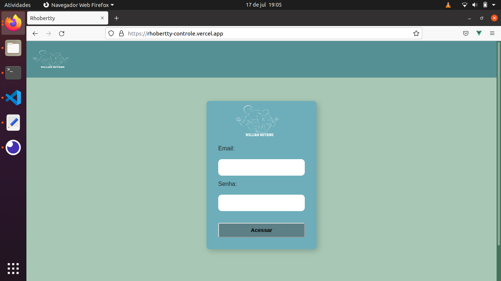
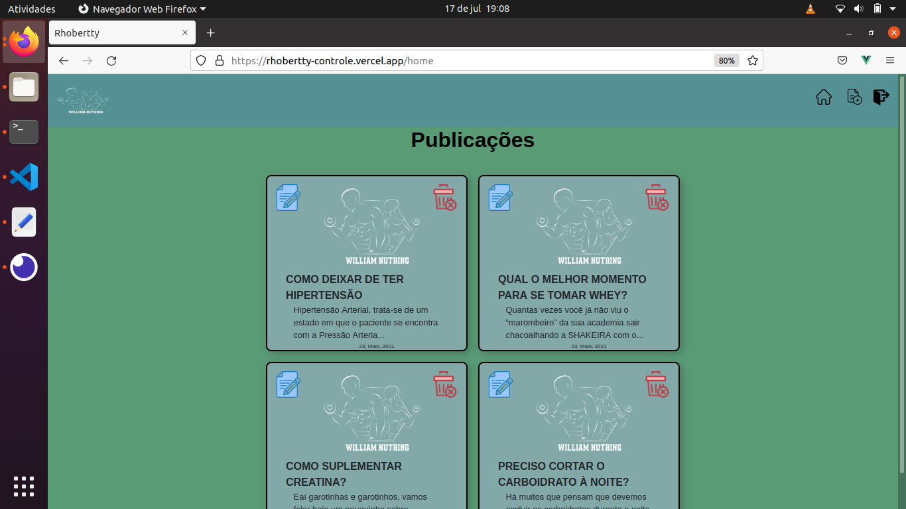
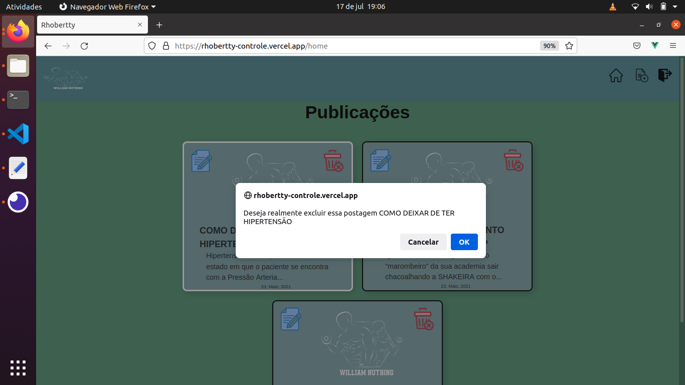

# Controle de Publicações

    

Sistema web desenvolvido para realizar o controle de publicações do blog do cliente Rhobertty

# O que faz?

- Cadastro de Posts 
- Pesquisa de Post
- Alteração
- Exclusão de Posts

# Imagens

- Home

  

      
  

- Alterar

  

      
  

- Excluir
  

      
  

# Tecnologias Usadas:

- [VueJs](https://vuejs.org/)
- HTML, CSS e Javascript
- Conexão com [API](https://rhobertty-api.herokuapp.com/api) que controla o acesso a aplicação e retorna os dados de publicações

# Execução

Realize o git clone do projeto
Acesse a pasta do projeto com o terminal de sua preferência
Execute:

<code>
    npm i
</code>

Após instalado, execute:
<code>
npm run serve
</code>

Acesse a aplicação pelo o link: http://localhost:8080/

# Link

https://rhobertty-controle.vercel.app/
